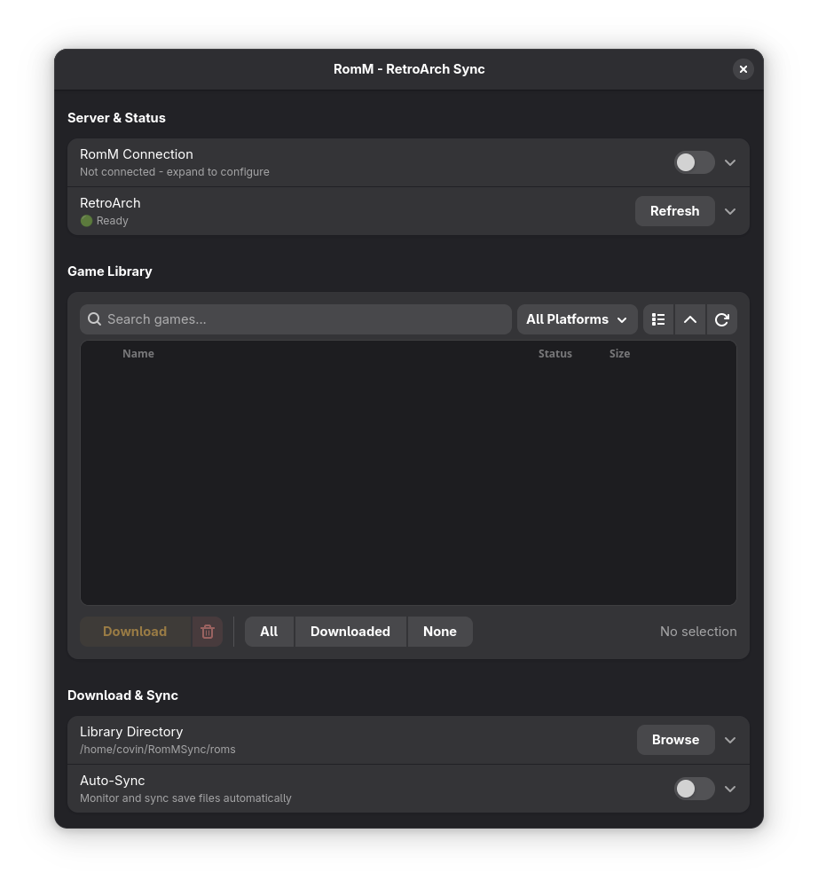

# RomM-RetroArch Sync

A desktop application for managing your retro game library by syncing ROMs, saves, and save states between RomM server and RetroArch.

## 📥 Download

**[All Releases](https://github.com/Covin90/romm-retroarch-sync/releases)** • **[Issues](https://github.com/Covin90/romm-retroarch-sync/issues)**

## ✨ Features

- **🎮 Game Library Management**: Browse and download your entire RomM game collection
- **🔄 Auto-Sync**: Automatically sync save files and save states between RetroArch and RomM
- **🚀 RetroArch Integration**: Launch games directly with appropriate cores

## 🚀 Quick Start

### Download AppImage (Recommended)

1. Download the latest `RomM-RetroArch-Sync.AppImage` from [Releases](../../releases)
2. Make it executable: `chmod +x RomM-RetroArch-Sync.AppImage`
3. Run: `./RomM-RetroArch-Sync.AppImage`

## 🔧 Configuration

1. **Connect to RomM**: Enter your RomM server URL and credentials
2. **Verify RetroArch**: Check that RetroArch installation is detected
3. **Set Download Path**: Choose where to store downloaded ROMs
4. **Enable Auto-Sync**: Turn on automatic save file synchronization

## 🔗 Links

- **RomM Project**: [GitHub](https://github.com/rommapp/romm)
- **RetroArch**: [Official Site](https://www.retroarch.com/)

## 📜 License

This project is licensed under the GNU General Public License v3.0 - see the [LICENSE](LICENSE) file for details.

## 🤝 Contributing

Contributions are welcome! Please feel free to submit a Pull Request.

## 🐛 Bug Reports

Found a bug? Please [open an issue](../../issues) with details about your system and the problem.

---

**Note**: This application requires a running RomM server and is designed for personal game library management. Please ensure you own the games you are downloading and managing.
